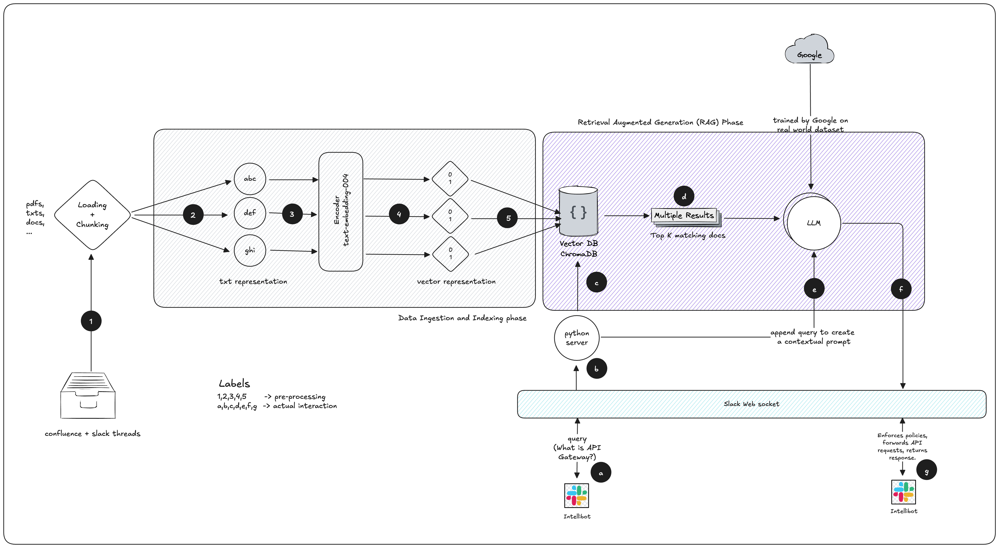

# intellibot

A bot that resolved queries and is trained on private knowledge base

This bot basically uses RAG and LangChain to resolve queries based on a private knowledge base.

The prompt usually looks like this:

```You are a helpful assistant that answers questions based on the provided context. If you don't know the answer, just say that you don't know, don't try to make up an answer.
Context: 
[Retrieved documents Chunk 1]
[Retrieved documents Chunk 2]
[Retrieved documents Chunk 3]

Question: {Original User Query}

If you don't know the answer, just say that you don't know, don't try to make up an answer.```
```

The documents are retrieved using a vector store and the query is answered using a language model.
We are using the chromadb vector store and langchain to build this bot.

To create the embeddings, we are using the Google's `text-embedding-004` via `google-generativeai` package.

In order to prepare our private knowledge base, we will need to get all the documents (pdfs, txt, markdowns, confluence) etc.
We are going to use the `langchain` package to load these documents and create embeddings for them.

# HLD
